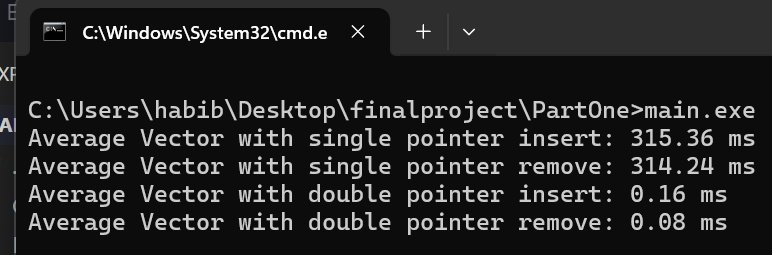

# Final Project: Vector Class Enhancements and Device Simulation

## Introduction
This project focuses on enhancing a custom C++ `Vector` class and analyzing its performance. Additionally, it implements a `Device` class to model realistic systems composed of simple and complex parts. The project is divided into two parts:

1. Enhancing and analyzing the performance of a `Vector` class.
2. Implementing a `Device` class with realistic calculations for volume, surface area, and mass.

## Part 1: Enhancing the Vector Class

### New Functionalities Added
1. **`insert(int i)`**: Inserts an element at the specified index `i`.
2. **`remove(int i)`**: Removes the element at the specified index `i`.

### Performance Analysis
The performance of the `Vector` class was evaluated by creating a vector containing hundreds of shape objects. Each shape allocates a significant amount of memory (hundreds of megabytes). CPU clock measurements using `std::clock()` were taken during various `insert` and `remove` operations.

#### Comparison Between Implementations
The project compared the performance of:
- **Vector with `T*` Implementation**: The standard approach using raw pointers.
- **Vector with `T**` Implementation**: An alternative approach using double pointers.

The results of the performance analysis are showen below:

### Key Observations
- The `T**` implementation was generally faster and more efficient.
- The `T*` implementation showed slightly higher overhead due to additional pointer indirections.
- The differences highlight trade-offs in memory management versus performance, which are elaborated in the full analysis.

## Part 2: Device Class Implementation

### Device Class Features
The `Device` class is designed to model realistic systems that consist of various components, such as an automobile with parts like the engine, gearbox, and fuel filter. The device is recursively composed of both simple and complex parts.

#### Core Functionalities
- **`EvalVolume()`**: Calculates the total volume of the device, including all child devices and components.
- **`EvalSurface()`**: Calculates the total surface area of the device and its components.
- **`EvalMass()`**: Computes the total mass of the device using the formula `mass = density * volume` for each component.

### Test Cases
Several test cases were developed to ensure the correctness of the `Device` class’s methods. These tests verify that the calculations account for both simple and nested components accurately.

